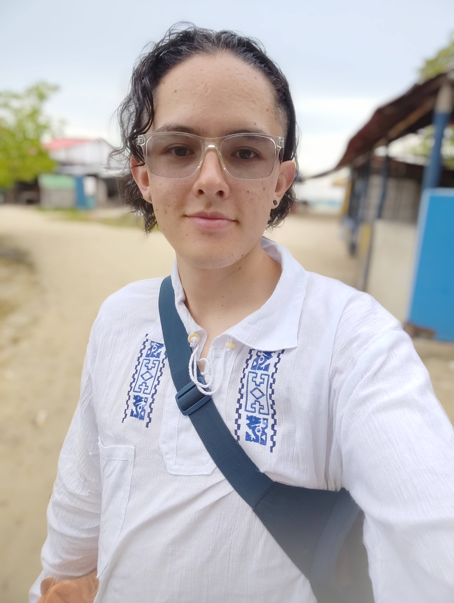

# Delfines invasores
El grupo con más potencial para invadir los conocimientos de la programación.

## Kevin Acero
### Rol en la industria
1. Programador de juegos.
2. Programador de juegos con IA.

### Ubicación
Bogotá, Colombia.

### Perfil
Tecnologo en animación 3D y estudiante de ingeniería multimedia, experiencia en graficación y programación para televisión.

## Valentina Ruiz
### Rol en la industria
1. Productora audiovisual.
2. Desarrolladora multimedia.

### Ubicación
Bogotá, Colombia.

###
## Angie Buitrago

### Perfil
Tecnologa en Animación 3D y estudiante de ingeniería multimedia, experiencia en modelado 3D e illustración

## Angie Buitrago

### Rol en la industria
1. Artista de personajes
2. Modelador 3D.

### Ubicación
Bogotá, Colombia.

## Belky Giron

### Perfil
Estudiante de ingeniería multimedia.

### Rol en la industria
1. Probador de juegos y control.
2. Desarrollador de sistemas.

### Ubicación
Bogotá, Colombia.
